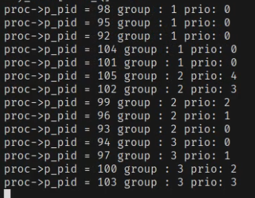
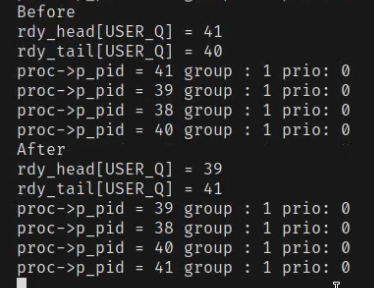
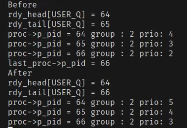
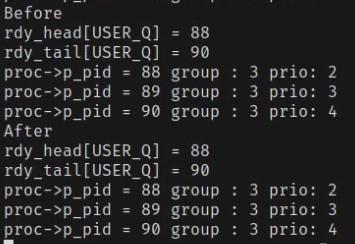
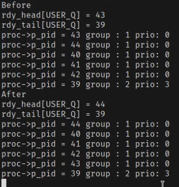
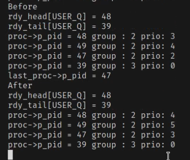
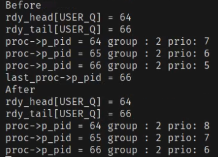
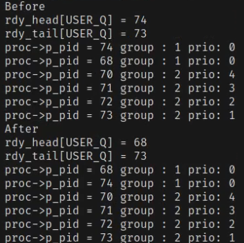
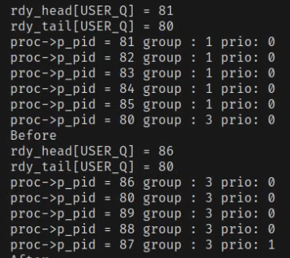
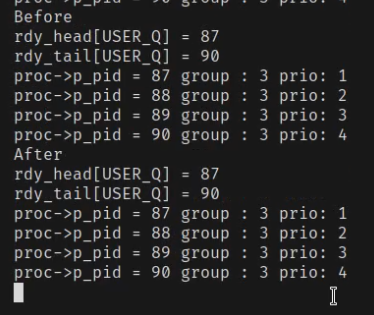

# Tomasz Smoleń SOI lab2

Nr. albumu 331434

#### Opis

W celu wykonania zadania zaimplementowałem trzy grupy procesów w systemie minix (1,2,3), wykonywane w kolejności 1->2->3, każda z nich z innym wewnętrznym algorytmem szeregowania.

Udało mi się to uzyskać za pomocą stworzenia trzech logicznych kolejek wewnątrz jednej fizycznej kolejky USER_Q, zawsze w niej na początku będa procesy o grupie 1, potem 2, potem 3:

Do struktury procesu  w proc.h dodałem pole prc_group oraz pri_val:

- prc_group odpowiada za grupe (1,2,3)

- pri_val to pole które informuje o wartości priorytetu wewnątrz grupy, w grupie drugiej będzie to wiek procesu i na poczatku będą szły procesu o jak największej tej wartości, będzie ona też rosnąć z czasem, w grupie 3 najpierw będą się wykonywały procesy z jak najmniejszą wartością pola pri_val ponieważ reprezentuje tam ona założony czas wykonywania a algorytm to sjb.

Planista patrzy na grupe procesu na wskaźniku rdy_head[USER_Q] po czym uruchamia odpowiedni algorytm dla tej grupy.

Dodatkowo dodałem syscalle setpri oraz getpri do ustawiania i sprawdzania wartości grup i priorytetów procesów, korzystają one z taskcalli sys_setpri o sys_getpri.

#### Grupa 1

Algorytm szeregowania round robin, procesy będą powoli przesuwać się z tyłu kolejki jedynek na początek, po czym znowu trafiać na koniec, upewniam się, że proces trafia na odpowiednie miejsce kolejki przy podczas wykonywania funkcji ready()

Przykład działania round robin:

proces 41 trafił z początku kolejki na jej koniec, a 39 został nową głową kolejki i teraz będzie wykonywany

#### Grupa 2

Algorytm starzenia.

Procesy z grupy drugiej będą wykonywane, jeśli nie ma w kolejce żadnych procesów grupy pierwszej, są one na bieżąco sortowane poprzez wstawianie w odpowiednim miejscu wdg parametru pri_val w funkcji read().

Przy każdym wykonaniu algorytmu starzenia procesy z grupy drugiej będą "postarzane", tzn. inkrementowana będzie ich wartość pri_val

Przykład działania:

Teoretycznie dzięki funkcji ready na początku kolejki dwójek zawsze i tak powinien być najstarszy proces, ale dodatkowo upewniam się, że algorytm działa poprawnie poprzez znajdywanie najstarszego wewnątrz grupy i wstawianiu go na początek (np jakbysmy manualnie zmienili któremuś procesowi wiek i byłby on największy to ważne by i tak był wykonany jako pierwszy)

#### Grupa 3

Algorytm shortest job first

Grupa trzecia działa podobnie jak grupa druga, tylko, że wartości nie są inkrementowane, a procesy są ustawiane rosnąco, a nie malejąco.
Pri val w tym przypadku reprezentuje zakładany czas wykonania programu, trzeba go ustawić syscallem setpri().

Przykład:

## Testy

Testy wykonuje, wywołując fork() i ustawiając priorytety/grupy procesom za pomocą setpri(), stworzone procesy wchodzą w pętle inkrementowania do 100 milionów, żeby miały coś do roboty, a planista mógł się wykazać.

Poniższe zrzuty ekranu są screenami z nagrania wszystkich testów, które łącznie wykonują się ok. 45 sekund. Wywołuje je wszystkie run_tests.sh, a każdy z nich jest osobnym programem napisanym w C.

W testach też wykorzystuje fakt, że nowe procesy są tworzone z grupą parenta (do_fork())
#### test.c

Ten test jest najbardziej ogólnym ze wszystkich, po prostu na początku tworzy procesy o grupie 1, potem 2, potem 3.

Najpierw 1, potem 2...

potem 3...

#### test2.c

Ten test bardziej się skupia na odpowiednim działaniu algorytmu starzenia, najpierw tworzone są jedynki, potem dwójki, każda z mniejszym wiekiem, żeby pokazać, że trafiają w odpowiednie miejsce

#### test3.c

Test trzeci pokazuje, że nawet jak kolejka jest zapełniona przez np. dwójki, to jedynki poprawnie trafią przed nie w kolejce

#### test4.c

Test analogiczny do drugiego, tylko, że dla grupy 3 a nowe proceys będą tworzone z coraz większym czasem wykonania.

Moment kiedy procesu grupy 1 skonczyly sie wykonywac i procesu grupy 3 zostały stworzone:

Wykonuje się ten z najmniejszym założonym czasem wykonania:

#### test5.c

Chyba najciekawszy test, na zmiane tworzone są procesy o grupach 1,2,3. Sprawdzamy, czy pomimo tego wszystko dalej działa.

Działa:

### Uwagi:

- w proc.c napisałem funkcję control_print(), dzięki której mogę testować i pokazywać wyniki, wszystko z powyższych screenów jest jej zawdzięczone

- w proc.c napisałem też funkcję find_last_for_group(), bez której implementacja trzech kolejek byłoby niemożliwe, znajduje ona ostatni proces z danej grupy i dzięki temu wiemy które procesy nas obchodzą.

- w proc.c napisałem też funkcję correct_tail(), która upewnia się, że wskaźnik rdy_tail[USER_Q] jest w odpowiednim miejscu po każdym wywołaniu planisty, uznałem to za łatwiejsze niż bicie sie z warunkami w poszczególnych algorytmach.

- zmodyfikowałem do_fork() w pliku system.c, dzięki czemu nowe procesu są tworzone z grupą parenta, a ich pri_val jest inicjalizowany jako 0

- w sys_setpri i do_fork sprawdzam czy grupa należy do 1 lub 2 lub 3

- w sys_setpri i sys_getpri szukam procesu zwyczajnie iterujac po tablicy procesów, jeśli nie znajde zwracam błąd.
  
  